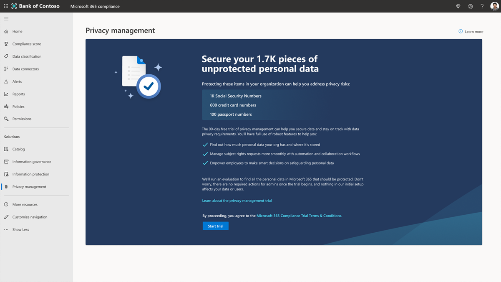

# Пробный сборник схем: Microsoft Priva

Добро пожаловать в пробную книгу Microsoft Priva.

Эта книга поможет вам сделать большую часть 90-дневной бесплатной пробной пробной части, обеспечив защиту персональных данных и создав надежное рабочее место для конфиденциальности.

С помощью рекомендаций Корпорации Майкрософт вы узнаете, как Priva может помочь вам активно выявлять и защищать от рисков конфиденциальности, таких как сбор данных, передача данных и чрезмерное использование данных, поможет вашей организации автоматизировать и управлять запросами субъектов на масштабе, а также уполномотит сотрудников принимать разумные решения по обработке данных.

## Начало работы

*Эти действия являются рекомендациями по ключевым функциям, которые необходимо попробовать в вашем 90-дневном пробном процессе.*

Начните пробную работу с настройки предварительных условий. Обратите внимание, что Priva состоит из двух ключевых решений , Priva Privacy Risk Management и Priva Subject Rights Requests, которые можно опробовыть и приобрести отдельно. Сведения о лицензировании и покупке можно найти в [Microsoft.com](https://www.microsoft.com/security/business/privacy/privacy-management-software?rtc=1#office-ContentAreaHeadingTemplate-8x0pmkp).

### Управление рисками конфиденциальности

С помощью **решения по управлению** рисками конфиденциальности можно изучить, как защитить персональные данные организации и создать надежное рабочее место.

- Упреждающие идентификации и защиты от рисков конфиденциальности, таких как сбор данных, передача данных и oversharing данных
- Получение видимости при хранении и движении персональных данных
- Уполномойте сотрудников информационных служб принимать разумные решения по обработке этих данных
- Позволяет пользователям эффективно управлять данными и принимать меры по соблюдению меняющихся правил конфиденциальности.

### Запросы на права субъекта

С помощью **решения "Запросы на права** субъекта" можно узнать, как обрабатывать запросы от первоначального запроса до подготовки отчетов.

- Управление запросами на права субъекта в масштабе

## Запуск пробной пробной программы Microsoft Priva

Если вы готовы приступить к использованию Microsoft Priva, выполните следующие действия, чтобы настроить необходимые условия и приступить к изучению информации о конфиденциальности.

1. [Подтверждение подписки и лицензирования](priva-setup.md#step-1-confirm-subscriptions-and-licensing)
1. [Настройка разрешений пользователей и назначение ролей](priva-setup.md#step-3-set-user-permissions-and-assign-roles)
1. Выберите "Начало пробной работы", и для вас будет сделано следующее:
    - Включены пробные лицензии Priva (это происходит в режиме реального времени)
    - Создаются сведения о конфиденциальности (это занимает 24 часа)

## Начало поиска и визуализации рисков конфиденциальности

Priva помогает вам понять данные, которые хранит организация, путем автоматизации обнаружения активов персональных данных и визуализации необходимой информации.

Чтобы начать, перейдите в раздел Priva Центр соответствия требованиям Microsoft 365 просмотреть эти страницы:

1. [Обзор](priva-data-profile.md#explore-the-overview-page). Предоставляет сводное представление о вашей позиции конфиденциальности, включая объем, категорию, расположение и перемещение персональных данных в Microsoft 365 среде. Кроме того, вы получаете сведения о текущем состоянии и тенденциях связанных рисков конфиденциальности, связанных с перешагонами, переносами или неиспользования персональными данными.
1. [Профиль данных](priva-data-profile.md#explore-the-data-profile-page). Предоставляет снимок персональных данных, хранимых организацией в Microsoft 365, включая объем, тип и расположение (хранение и география).

## Узнайте о политиках

Управление рисками конфиденциальности позволяет настроить политики, определяя риски конфиденциальности в Microsoft 365 среде и устроив легкое исправление.

1. [Узнайте о ключевых сценариях риска](risk-management.md#learn-about-key-risk-scenarios)
1. [Ограничение переэкспозера данных](risk-management.md#limit-data-overexposure)
1. [Поиск и смягчение переноса данных](risk-management.md#find-and-mitigate-data-transfers)
1. [Минимизация хранимой информации](risk-management.md#minimize-stored-data)

## Создание и настройка политик

Создайте новые политики в управлении рисками конфиденциальности для устранения сценариев риска конфиденциальности, важных для организации. Для быстрого начала используйте шаблоны по умолчанию для создания новых политик для переэкспорации данных, передачи данных и минимизации данных и сценариев.

1. [Создание политики из шаблона](risk-management-policies.md#create-a-policy-from-a-template)
1. [Создание настраиваемой политики](risk-management-policies.md#create-a-custom-policy)
1. [Узнайте о параметрах ключевых элементов для всех политик](risk-management-policies.md#learn-about-key-settings-for-all-policies)
1. [Сведения о параметрах политик минимизации данных](risk-management-policies.md#learn-about-settings-for-data-minimization-policies)
1. [Сведения о параметрах политик передачи данных](risk-management-policies.md#learn-about-settings-for-data-transfer-policies)
1. [Сведения о параметрах политик переэкспосыра данных](risk-management-policies.md#learn-about-settings-for-data-overexposure-policies)

## Управление политиками

После создания политик в управлении рисками конфиденциальности для обработки сценариев минимизации данных, передачи данных или переэкспорации данных может потребоваться просмотреть или обновить параметры политики. Кроме того, может потребоваться протестировать новую политику, прежде чем полностью ее развертывать для непрерывного использования.

1. [Просмотр сведений о политике](risk-management-policies-manage.md#view-policy-details)
1. [Проверка политики](risk-management-policies-manage.md#test-your-policy)
1. [Удаление политики](risk-management-policies-manage.md#delete-a-policy)

## Знакомство с оповещениями политики и проблемами

Проверка оповещений позволяет выявлять случаи, которые требуют последующей проверки. Это можно сделать, создав проблемы, которые дают пользователям структурированный способ просмотра контента, назначения серьезности проблемы и совместной работы по устранению проблем.

1. [Просмотр текущих оповещений и проблем](risk-management-alerts.md#view-current-alerts-and-issues)
1. [Управление оповещениями](risk-management-alerts.md#manage-alerts)
1. [Управление вопросами](risk-management-alerts.md#manage-issues)
1. [Просмотр содержимого и исправление проблем](risk-management-alerts.md#review-content-and-remediate-issues)

## Отправка пользователям уведомлений политики

Управление рисками конфиденциальности может напрямую уведомлять владельцев контента о совпадениях с вашими политиками передела, минимизации данных и передачи данных. С помощью уведомлений электронной почты пользователи могут легко узнать о контенте, который необходимо просмотреть.

1. [Подготовка обучающего контента для уведомлений о политике](risk-management-notifications.md#prepare-training-content-for-policy-notifications)
1. [Настройка уведомлений электронной почты для политик](risk-management-notifications.md#set-up-email-notifications-for-policies)
1. [Устранение проблем из уведомлений электронной почты](risk-management-notifications.md#remediate-issues-from-email-notifications)
1. [Отправка уведомлений в Teams](risk-management-notifications.md#send-notifications-in-teams)

## Узнайте о запросах на права субъекта

В соответствии с определенными правилами конфиденциальности по всему миру, отдельные лица (или субъекты данных) могут делать запросы на просмотр или управление персональными данными о себе, которые компании собрали. Эти запросы иногда также называются запросами субъектов данных (DSRs), запросами доступа к субъектам данных (DSA) или запросами прав потребителей. Запросы на права субъекта Priva могут помочь вам обрабатывать эти запросы.

1. [Создание запросов и сбор данных](subject-rights-requests-create.md)
1. [Соответствие данным](subject-rights-requests-data-match.md)
1. [Просмотр данных и совместное взаимодействие по запросам](subject-rights-requests-data-review.md)
1. [Выполнение запросов](subject-rights-requests-reports.md)
1. [Автоматизация задач](subject-rights-requests-automate.md)

## Создание запросов прав субъекта

Администраторы управления правами субъектов могут открывать новые запросы на права субъекта на главной странице "Запросы на права субъекта". Мастер поможет вам найти личные данные о субъекте данных и начать процесс выполнения их запроса.

1. [Используйте мастера запроса на права субъекта](subject-rights-requests-create.md#use-the-subject-rights-request-creation-wizard) — создайте запрос
1. [Определение параметров поиска](subject-rights-requests-create.md#define-search-settings)
1. [Уточнение параметров поиска](subject-rights-requests-create.md#refine-your-search)

## Управление соответствием данных запросам на права субъекта

С учетом совпадения данных организации могут позволить Приве определять субъекты данных на основе точных значений предоставленных данных.

1. [Подготовка к импорту данных](subject-rights-requests-data-match.md#prepare-for-data-import)
1. [Определение схемы персональных данных](subject-rights-requests-data-match.md#define-the-personal-data-schema)
1. [Upload персональные данные](subject-rights-requests-data-match.md#upload-personal-data)

## Просмотр данных и совместная работа над запросами прав субъекта

После создания запроса на права субъекта Прива будет использовать ваши вводимые сведения о субъекте, чтобы искать совпадения в среде Microsoft 365 организации. После компиляции этих данных можно просмотреть результаты, принять решение о том, что включать, и при необходимости отредактировать сведения.

1. [Просмотр сведений о запросе и отслеживание прогресса](subject-rights-requests-data-review.md#step-1-review-request-details-and-monitor-progress)
1. [Просмотр и редактирование поисковых запросов](subject-rights-requests-data-review.md#step-2-optional-view-and-edit-search-queries)  (необязательный)
1. [Просмотр данных](subject-rights-requests-data-review.md#step-3-review-data)
1. [Закрыть запрос](subject-rights-requests-data-review.md#step-4-close-the-request)

## Управление отчетами по запросам прав субъекта и выполнение запросов

После завершения проверки данных для запроса на права субъекта можно перейти к выполнению запроса.

1. [Подготовка окончательных отчетов для субъекта данных](subject-rights-requests-reports.md#prepare-final-reports-for-the-data-subject)
1. [Интеграция с решениями партнеров](subject-rights-requests-reports.md#integrate-with-partner-solutions)
1. [Управление хранением данных](subject-rights-requests-reports.md#manage-data-retention)

## Автоматизация задач запросов прав субъекта

Включение Power Automate потоков для Priva для автоматизации важных задач для дел и пользователей, таких как создание билетов в ServiceNow или добавление напоминаний календаря о сроках выполнения.

1. [Создание нового потока Power Automate из шаблона](subject-rights-requests-automate.md#create-a-new-power-automate-flow-from-a-template)
1. [Совместное Power Automate потока](subject-rights-requests-automate.md#share-a-power-automate-flow)
1. [Изменение или удаление Power Automate потока](subject-rights-requests-automate.md#edit-or-delete-power-automate-flow)

## Дополнительные ресурсы

**Документы Майкрософт**: подробные сведения о том, как работает Microsoft Priva и как наилучшим образом реализовать ее для вашей организации. [Посетите документы](priva-overview.md).

**Почему Microsoft Priva**: Узнайте больше о возможностях Priva в этом [видео](https://www.youtube.com/watch?v=6OLky1biPIQ).

**Дополнительные информацию о Microsoft Priva**: блоги, планы, цены [здесь](https://aka.ms/privacymgmt/web).

**Покупка Microsoft Priva**: управление рисками конфиденциальности и запросы на права субъекта продаются отдельно. Сведения о лицензировании и покупке можно найти в [Microsoft.com](https://www.microsoft.com/en-us/security/business/privacy/privacy-management-software?rtc=1#office-ContentAreaHeadingTemplate-8x0pmkp).
