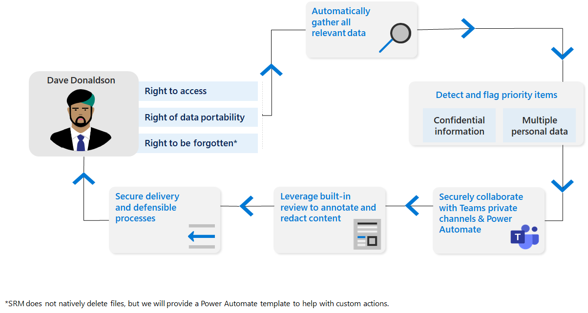

# Узнайте о запросах на права субъекта

В соответствии с определенными правилами конфиденциальности по всему миру отдельные лица (или субъекты *данных)* могут запрашивать сведения о том, что они собрали, или управлять ими. Эти запросы иногда также называются запросами субъектов данных (DSRs), запросами доступа к субъектам данных (DSA) или запросами на права потребителей. Для компаний, которые хранят большие объемы информации, поиск соответствующих данных может быть сложной задачей.

Управление конфиденциальностью может помочь вам обрабатывать эти запросы с помощью запросов на права субъекта. Он предоставляет возможности рабочего процесса, автоматизации и совместной работы для поиска данных субъектов, проверки результатов, сбора соответствующих файлов и создания отчетов.

## Как управление конфиденциальностью поддерживает выполнение запроса на права субъекта

Цикл запроса прав субъекта начинается с запроса человека в организацию. После этого можно использовать возможности управления конфиденциальностью для сбора этих данных, совместной работы, проверки и создания отчетов. Затем вы можете сообщить субъекту данных о своих выводах и принять любые другие действия, необходимые за пределами управления конфиденциальностью для выполнения запроса, например удаление данных. Для управления и автоматизации рабочего процесса можно также использовать интегрированные шаблоны управления конфиденциальностью Power Automate конфиденциальности.

### Создание запросов и сбор данных

Управление конфиденциальностью предоставляет мощные возможности поиска для поиска данных, связанных с субъектом данных, в контенте, который хранится в Microsoft 365. Это также помогает определить приоритеты элементов для проверки в пределах данных, которые вы собираете для этих запросов. Управление конфиденциальностью осведомлено о Microsoft Information Protection меток конфиденциальности, которые указывают содержимое, которое потенциально является конфиденциальным и может потребовать специального рассмотрения, и оно помечает элементы с этими метами. Кроме того, управление конфиденциальностью может обнаруживать и помечать элементы, которые могут содержать данные нескольких пользователей, где перед их поставкой субъекту данных может потребоваться отредактировать содержимое.

Дополнительные дополнительные возможности см. в [см. в "Создание запроса на права субъекта".](privacy-management-subject-rights-requests-create.md)

### Соответствие данным

С учетом совпадения данных можно включить управление конфиденциальностью для определения субъектов данных на основе точных значений предоставленных данных. Отправка сведений такого типа может повысить точность определения содержимого и упрощает необходимость вручную поставлять поля во время создания запроса на права субъекта. Он также предоставляет контекст в запросах на права субъекта и для плитки Обзор, которая демонстрирует ваши элементы с большим объемом контента субъекта данных. Дополнительные сведения см. в [см. в "Управление соответствием данным".](privacy-management-subject-rights-requests-data-matching.md)

### Просмотр данных и совместное взаимодействие по запросам

После сбора данных можно оценить результаты, выбрать наиболее релевантные элементы, которые будут включены в отчеты и экспорт, и внести необходимые изменения. Это может быть выполнено совместно между членами вашей команды в рамках конвейера управления конфиденциальностью.
Дополнительные новости см. в [обзоре и совместной работе по запросам на права субъектов.](privacy-management-subject-rights-requests-review.md)

### Выполнение запросов

Управление конфиденциальностью предоставляет средства для создания отчетов и сбора файлов для отправки в субъекты данных. Дополнительные дополнительные новости см. в см. в руб. Управление запросами на экспорт прав субъектов и [выполнением запросов.](privacy-management-subject-rights-requests-fulfill.md)

### Автоматизация задач

Вы можете создавать и автоматизировать процессы рабочего процесса в управлении конфиденциальностью с помощью встроенных Power Automate шаблонов. Эти шаблоны поддерживают такие задачи, как подача билетов в ServiceNow или настройка приглашений календаря. Дополнительные дополнительные функции см. в дополнительных подробной информации о задачах автоматического [запроса прав субъектов.](privacy-management-subject-rights-requests-automate-tasks.md)

## Юридический отказ

[Юридический отказ от управления конфиденциальностью](privacy-management-disclaimer.md)
